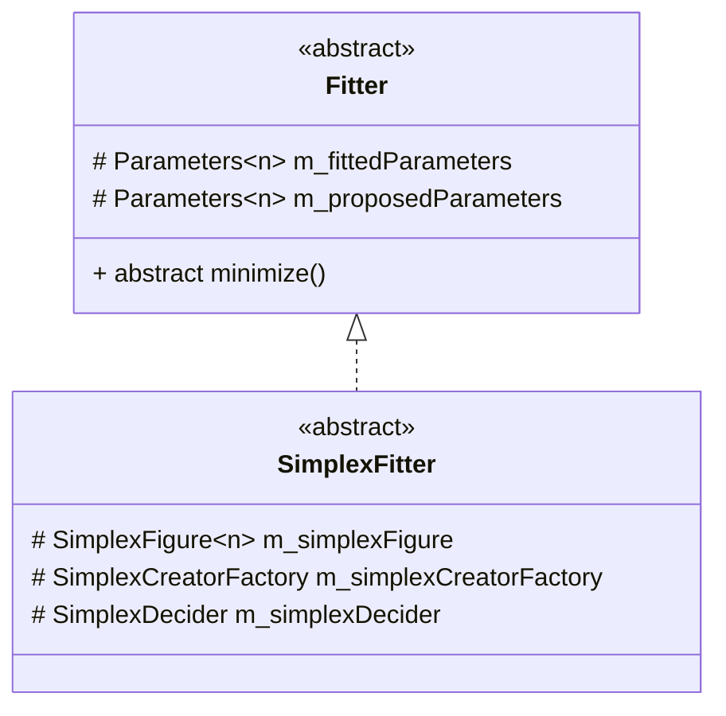

# Brief Explanation of the Abstract SimplexFitter Class

## The class diagram

## Simple explanation of the abstract SimplexFitter class
[About the General Simplex Algorithm](https://nils-olovsson.se/articles/downhill_simplex/#citation-crane)  
This abstract class serves as a blueprint for future implementations of Simplex optimization solvers. It is designed to allow users to define their own implementations of the Simplex optimization technique.

### The main idea
To ensure maximum flexibility, we have incorporated the factory design pattern extensively throughout this class. This approach enables us to extract functionality and facilitate easy customization.

