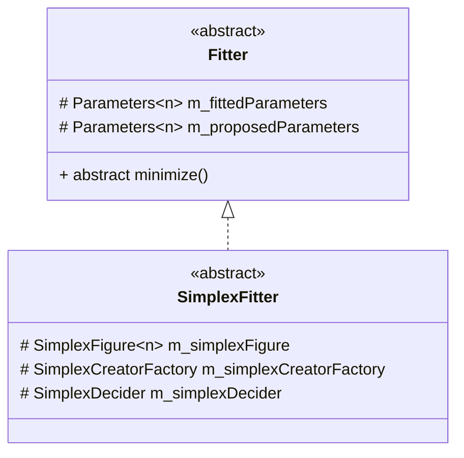

# The general description of the abstract SimplexFitter class

## The class diagram

## Simple explanation of the abstract SimplexFitter class
[About the General Simplex Algorithm](https://nils-olovsson.se/articles/downhill_simplex/#citation-crane)  
This class is the abstract class for future implementations of the Simplex optimization solvers. It was designed in such a way that the user could define his own implementation of the Simplex optimization technique. 

### The main idea
Because we want to make this class really general, we decided to use factory design pattern almost in every place. This technique allows us to extract the some functionality 