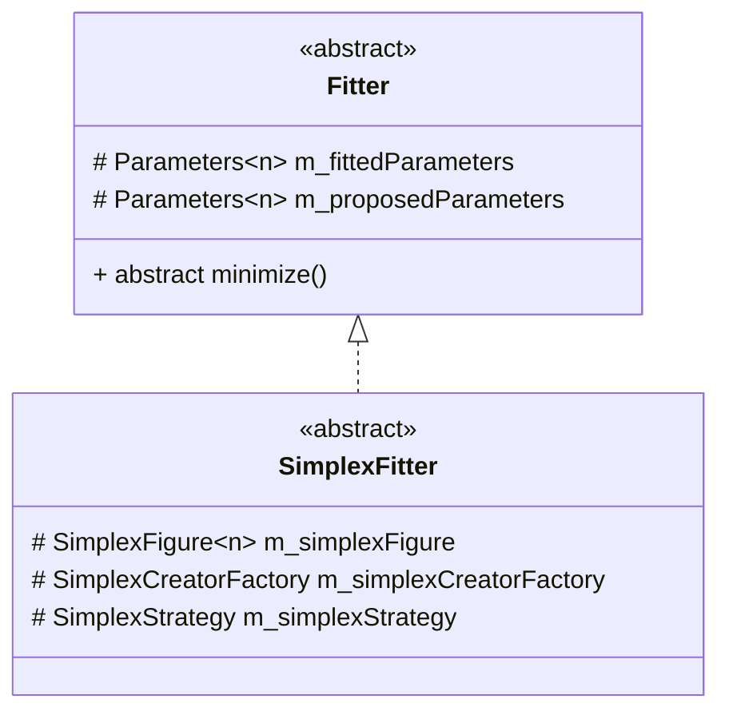

# Brief Explanation of the Abstract SimplexFitter Class

## The class diagram

## Simple explanation of the abstract SimplexFitter class

[About the General Simplex Algorithm](https://nils-olovsson.se/articles/downhill_simplex/#citation-crane)  
This abstract class serves as a blueprint for future implementations of Simplex optimization solvers. It is designed to allow users to define their own implementations of the Simplex optimization technique.

### The main idea

To maximize flexibility, we have extensively integrated the factory design pattern into this class. This method allows us to abstract functionality and enables easy customization.

To generally utilize the SimplexFitter class, you need to create a specific SimplexOperationFactory and a StrategyManager.

In the SimplexOperationFactory, you must register concrete operations, which are defined in the same directory as the SimplexOperationFactory.

In the StrategyManager, you must register at least one concrete class that inherits from IDecision. If you wish to alter the decision-making process in the simplex algorithm over time, you should register additional deciders and dynamically change them in the minimize function based on certain conditions.

We recommend performing all operations in a for loop and passing all these Simplex figures into the simplex decider. The time cost of this operation will not be significant [1].

This approach allows you to leverage the flexibility in deciding which operations to perform and which operation will yield the final result. This strategy may evolve over time, but the logic should be abstracted into a different class or implemented in the minimize function.

[1]: Ultimately, it involves only the addition and multiplication of small sets of numbers.

### Example code
